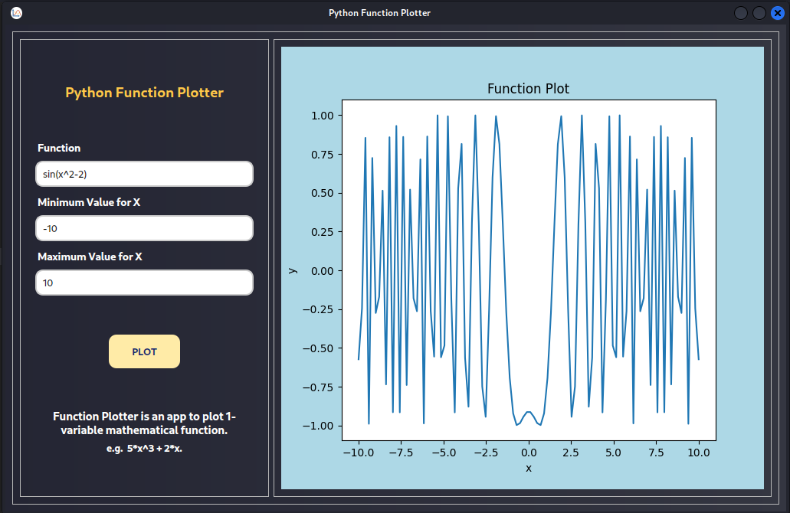

# Python Function Plotter
[](https://www.gnu.org/licenses/gpl-3.0)
[](https://www.python.org/)

The Python Function Plotter is a graphical tool that allows users to plot mathematical functions and visualize their behavior. It provides an interactive interface where users can input mathematical expressions, specify the range of values, and generate plots of the corresponding functions. The project utilizes Python's mathematical libraries and GUI frameworks, enabling users to explore and analyze various mathematical functions conveniently.

## Installation For Linux, Mac, and Windows

```bash
    
    cd python-function-plotter/
    pip install -r requirements.txt
```

**Prerequisites**
* Python 3.6 or above

## Clone the repository
```bash
    git clone https://github.com/m-emadeddin/python-function-plotter.git
    cd python-function-plotter/
```
## Install dependencies
```bash
    pip install -r requirements.txt
```

## Usage
**Run the application**
```bash
    python function_plotter.py
```
**Test the application**
```bash
    pytest -v
```

## Features
* **Drawing Graphs:** Users can input mathematical expressions using standard mathematical notation, including functions like trigonometric, logarithmic, and exponential functions, and visualize their graphs.
* **Customizable Range:** Users can specify the range of values for the x-axis to zoom in or out and focus on specific regions of the graph.
* **Validation:** The application performs validation on user input, ensuring that the mathematical expressions and range values are valid and providing helpful error messages if any issues arise.
Screenshots


## Snapshots

* **Application Main Window**


* **Application Working Example #1**


* **Application Working Example #2**


* **Application GUI Responsiveness**


* **Application Testing Results**


* **Application Wrong Example #1**


* **Application Wrong Example #2**


* **Application Security Check Failure**
